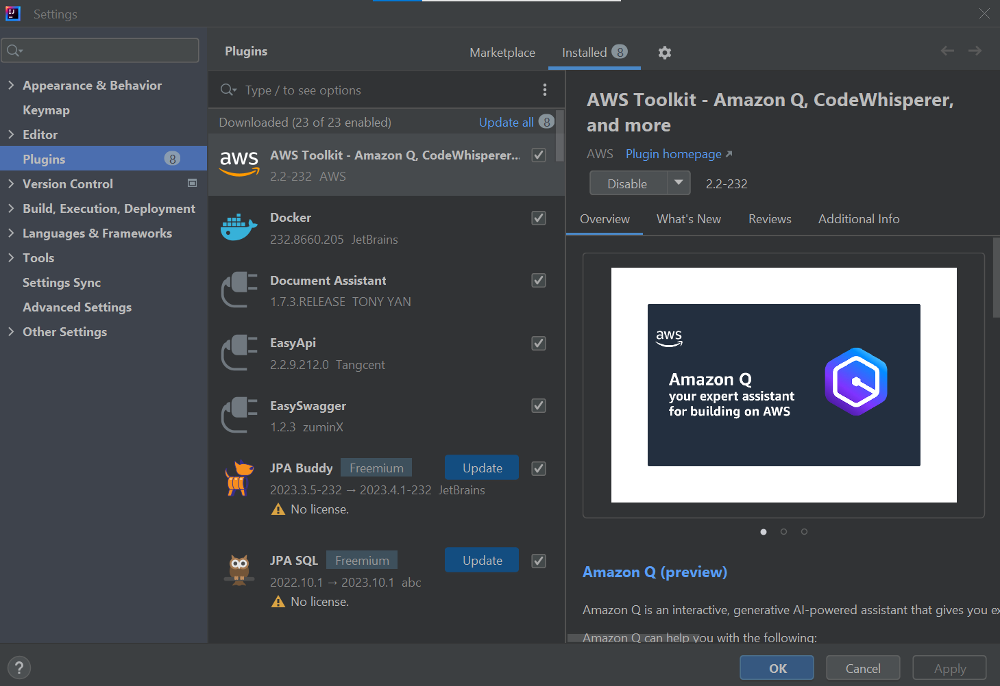

# Criar, listar e excluir Amazon S3 buckets

  Cada objeto (arquivo) no Amazon S3 deve residir em um bucket. Um bucket representa um conjunto
  (contêiner) de objetos. Cada bucket deve ter uma chave (nome) exclusiva.

### 1-Criando a Conta na AWS

   https://aws.amazon.com/pt/console/


### Será preciso fazer o download do arquivo das suas credencias


    Você terá que gerar o  arquivo de credenciais e fazer download para sua
    máquina. Exportar o arquivo .SSH das cridênciais

### Para criar o projeto exemplo no windows

    mvn archetype:generate -DarchetypeGroupId=software.amazon.awssdk -DarchetypeArtifactId=archetype-app-quickstart -DarchetypeVersion=2.20.43
    ( DarchetypeArtifactId=archetype-app-quickstart -- neste caso, "quickstart" será o nome do projeto)

### No console da sua máquina, Use o comando para configurar o acesso a AWS

    aws-configure

    Responda as perguntas do prompt usando os valores abaixo - conforme as variáveis vindas no arquivo de credenciais .ssh
	
	AWS_ACCESS_KEY_ID      = AAKIAQLZUUMZJDQZBKY644
	AWS_SECRET_ACCESS_KEY  = BcuaUxB7Jjpg00pk0zu287Ins9kNeRxDsXPflhnTg0
	AWS_DEFAULT_REGION     = us-east-1

### Para saber se a configuração está OK

    aws sts get-caller-identity

### Você deverá ter um retorno conforma abaixo
  
    C:\Projetos AWS JC\getstarted>aws sts get-caller-identity
    {
    "UserId": "AAIDAQLZUUMZJOH7RP2AD44",
    "Account": "025340093321682",
    "Arn": "arn:aws:iam::025343321682:user/Jcaboclo@1960useriam"
    }


### Para compilar o projeto, use o comando, na mesma pasta onde você criou o projeto

    mvn clean package


    mvn clean package

### Para executar

    mvn exec:java -Dexec.mainClass="org.example.App"

# 2- O Projeto

    This project contains a maven application with [AWS Java SDK 2.x](https://github.com/aws/aws-sdk-java-v2) dependencies.

## Prerequisites
  - Java 1.8+
  - Apache Maven
  - GraalVM Native Image (optional)

### Instale o Plugin da AWS Toolkit na seu intellij



## Development

- `HandlingAWSS3buckets.java`: main entry of the application
        creates the SDK client and also
        Calls the createBucket,  ListBuckets, and DeleteBucket operations

        package org.example;
        
        import software.amazon.awssdk.regions.Region;
        import software.amazon.awssdk.services.s3.S3Client;
        import org.slf4j.Logger;
        import org.slf4j.LoggerFactory;
        
        import static org.example.S3BucketOperations.*;
        
        public class HandlingAWSS3buckets {
        private static final Logger logger = LoggerFactory.getLogger(HandlingAWSS3buckets.class);
        
            public static void main(String... args) {
                logger.info("Application starts");
        
               // snippet-start:[s3.java2.s3_bucket_ops.region]
                Region region = Region.US_EAST_1;
                S3Client s3 = S3Client.builder()
                        .region(region)
                        .build();
        
                // snippet-end:[s3.java2.s3_bucket_ops.region]
                String bucket = "bucket" + System.currentTimeMillis();
                System.out.println(bucket);
                createBucket(s3, bucket);
                logger.info("Create Bucket performed - Bucket: "+bucket);
                ListBuckets(s3, bucket) ;
                logger.info("ListBuckets performed - Bucket: "+bucket);
                DeleteBucket(s3, bucket) ;
                logger.info("DeleteBucket performed  - Bucket: "+bucket);
                logger.info("Application ends");
            }
        
        }


## S3BucketOperations.java 

    Perform the operations

    package org.example;
    
    import software.amazon.awssdk.core.waiters.WaiterResponse;
    import software.amazon.awssdk.regions.Region;
    import software.amazon.awssdk.services.s3.S3Client;
    import software.amazon.awssdk.services.s3.model.CreateBucketRequest;
    import software.amazon.awssdk.services.s3.model.S3Exception;
    import software.amazon.awssdk.services.s3.model.HeadBucketRequest;
    import software.amazon.awssdk.services.s3.model.HeadBucketResponse;
    import software.amazon.awssdk.services.s3.model.ListBucketsRequest;
    import software.amazon.awssdk.services.s3.model.ListBucketsResponse;
    import software.amazon.awssdk.services.s3.model.DeleteBucketRequest;
    import software.amazon.awssdk.services.s3.waiters.S3Waiter;
    public class S3BucketOperations {
    
        // Create a bucket by using a S3Waiter object
        public static void createBucket( S3Client s3Client, String bucketName) {
            try {
                S3Waiter s3Waiter = s3Client.waiter();
                CreateBucketRequest bucketRequest = CreateBucketRequest.builder()
                        .bucket(bucketName)
                        .build();
    
                s3Client.createBucket(bucketRequest);
                HeadBucketRequest bucketRequestWait = HeadBucketRequest.builder()
                        .bucket(bucketName)
                        .build();
    
                // Wait until the bucket is created and print out the response.
                WaiterResponse<HeadBucketResponse> waiterResponse = s3Waiter.waitUntilBucketExists(bucketRequestWait);
                waiterResponse.matched().response().ifPresent(System.out::println);
                System.out.println(bucketName +" is ready");
    
            } catch (S3Exception e) {
                System.err.println(e.awsErrorDetails().errorMessage());
                System.exit(1);
            }
        }
        // snippet-end:[s3.java2.s3_bucket_ops.create_bucket]
    
        public static void ListBuckets(S3Client s3, String bucket) {
            // snippet-start:[s3.java2.s3_bucket_ops.list_bucket]
            // List buckets
            ListBucketsRequest listBucketsRequest = ListBucketsRequest.builder().build();
            ListBucketsResponse listBucketsResponse = s3.listBuckets(listBucketsRequest);
            listBucketsResponse.buckets().stream().forEach(x -> System.out.println(x.name()));
            // snippet-end:[s3.java2.s3_bucket_ops.list_bucket]
    
        }
    
        public static void DeleteBucket(S3Client s3, String bucket) {
            // Delete empty bucket.
            // snippet-start:[s3.java2.s3_bucket_ops.delete_bucket]
            DeleteBucketRequest deleteBucketRequest = DeleteBucketRequest.builder()
                    .bucket(bucket)
                    .build();
    
            s3.deleteBucket(deleteBucketRequest);
            s3.close();
            // snippet-end:[s3.java2.s3_bucket_ops.delete_bucket]
        }
    }

## Analyzing the results

## Intellij


## AWS


- `S3BucketOperations.java`: 


#### Building the project
```
mvn clean package
```
#### Documentos de referências com tudo necessário aos estudos

    aws-sdk-java-dg-v2 - EM INGLÊS.pdf
    aws-sdk-java-dg-v2 - EM PORTUGUÊS.pdf


